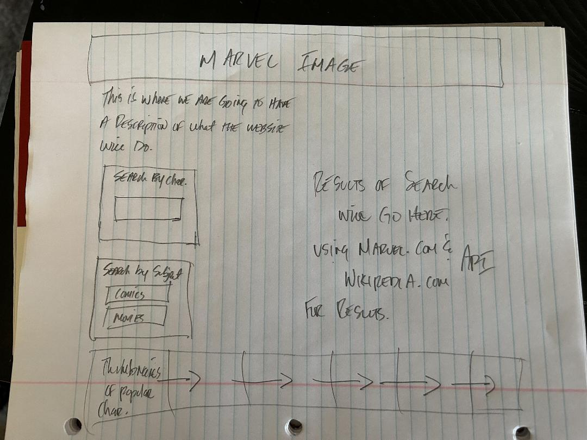

# marvel-search

## User Story

* As a Marvel fan, I want to create a webpage where other fans can search their favorite character and get their history, including movies, comics, series and more. 

## Acceptance Criteria

* It is done when I have a search function on the site

* It is done when the user can type in their favorite character and get a search history

* It is done when the site shows the top ten popular characters and the user can click on their image and be taken to Marvel.com to show their history. 

* It is done when the user can search more specifically by using certain search criteria, including but not limited to comics, movies, and series. 

* It is done when the website looks correct on Iphones and Ipads. 

* It is done when the website is accessible. 

## Assets

## Resources
 // Add the resources we used, everything else is done. 